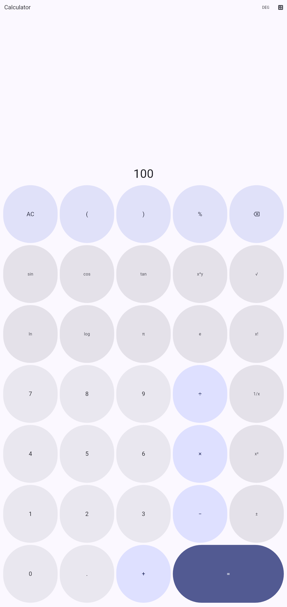
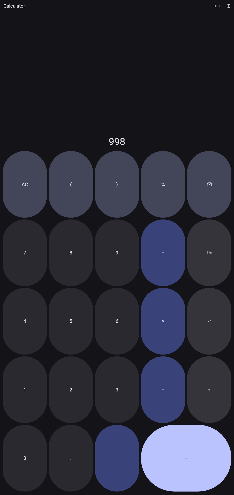

# Scientific Calculator

A scientific calculator for Android, built with Flutter.

<p>
  
  
  
</p>

## Features

- Basic arithmetic (`+ − × ÷`), percentages, sign toggle, parentheses
- Scientific functions: `sin cos tan`, inverses, `ln log`, `sqrt`, `x²`,
  `x^y`, `1/x`, `x!`, and the constants `π`/`e`
- Degrees/radians toggle
- Live result preview as you type
- Material 3 UI with light and dark themes
- No permissions, no network access, no ads, no data collection

## Project layout

```
app/                          Flutter application
  lib/
    calculator_engine.dart    Expression tokenizer/parser/evaluator (pure Dart)
    calculator_controller.dart Token-based input state for the on-screen keypad
    number_format.dart        Result formatting (trims float noise, sci. notation)
    main.dart                 UI (display + keypad)
  test/
    calculator_engine_test.dart  44 unit tests covering the math engine
    widget_test.dart             5 widget tests covering the keypad end to end
  tool/
    generate_screenshots.dart Regenerates the Play Store screenshots
  android/                   Android platform project (Gradle, manifest, icons)
store_assets/                Play Store icon + feature graphic
docs/
  PLAY_STORE_RELEASE.md     Step-by-step guide to build, sign, and publish
  STORE_LISTING.md          Ready-to-paste store listing copy
  PRIVACY_POLICY.md         Privacy policy (the app collects no data)
```

## Getting started

```bash
cd app
flutter pub get
flutter analyze
flutter test
flutter run
```

## Publishing to the Play Store

See [`docs/PLAY_STORE_RELEASE.md`](docs/PLAY_STORE_RELEASE.md) for the full
walkthrough: generating an upload key, building the release App Bundle, and
filling in the Play Console listing (copy is pre-written in
[`docs/STORE_LISTING.md`](docs/STORE_LISTING.md)).

Publishing itself has to happen from your own Google Play Console account
— that step needs your Google developer identity and can't be done on your
behalf.
