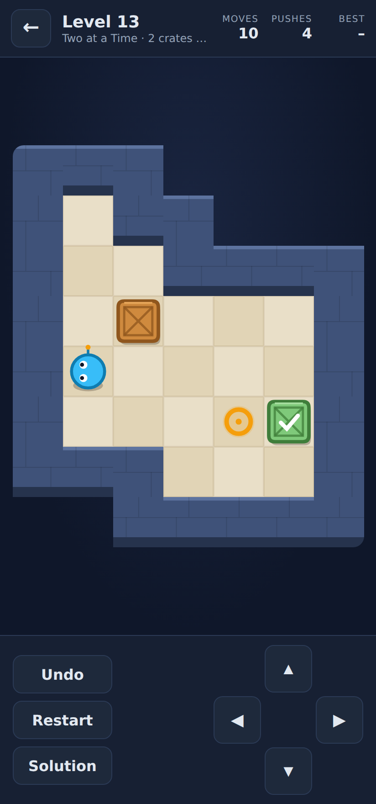
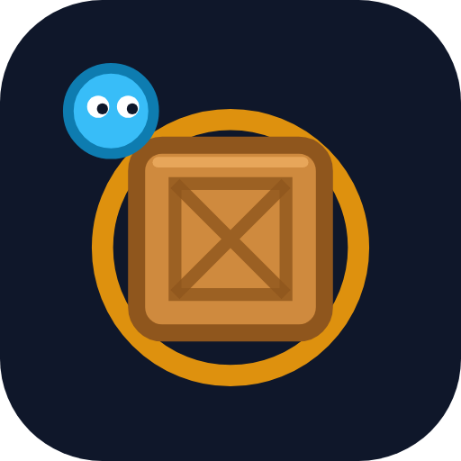

# Crate Quest

A crate-pushing puzzle game with **100 levels** that start at a single push and
end at six-crate, 50-push brain-melters. Runs in any browser and ships as an
Android APK.

<p>
  
  
</p>

## How to play

Push every crate onto a glowing pad. You can only push (never pull), one crate
at a time, so a crate shoved into a corner is stuck for good: undo (Z) and
restart (R) are always one tap away.

- **Keyboard:** arrow keys or WASD, `Z`/Backspace undo, `R` restart, `Esc` back
- **Touch:** swipe on the board, use the on-screen pad, or **tap a floor tile**
  to walk there (tap a crate next to you to push it)
- **Solution:** every level ships with an optimal solution you can watch. It
  marks the level as *solved with help* (a check mark instead of a star) and
  unlocks the next one, so nobody gets stuck.

Progress is saved on the device (browser localStorage / app storage). No
network, no ads, no permissions.

## Difficulty curve

| World | Name | Crates | Optimal pushes |
|---|---|---|---|
| 1 | First Steps | 1 | 1 - 6 |
| 2 | Two at a Time | 2 | 6 - 12 |
| 3 | Tight Corners | 2 - 3 | 13 - 16 |
| 4 | Warehouse | 3 | 16 - 21 |
| 5 | Logistics | 3 - 4 | 21 - 24 |
| 6 | Cargo Bay | 4 - 5 | 25 - 33 |
| 7 | Freight Yard | 4 - 6 | 28 - 34 |
| 8 | Dockside | 4 - 6 | 30 - 41 |
| 9 | Deep Storage | 5 - 6 | 35 - 42 |
| 10 | Grandmaster | 5 - 6 | 39 - 56 |

(All 100 levels are ordered by a difficulty score of optimal pushes plus a
premium per crate, so it never drops from one level to the next.)

## How the levels are made

`tools/generate_levels.js` builds every level deterministically from a seed:

1. carve a random room,
2. put the crates on the pads (the solved state),
3. run a breadth-first search *backwards*, pulling crates away from the pads.
   Each pull is a push in reverse, so the search depth of a state is exactly
   the minimum number of pushes needed to solve it,
4. pick a start state at the depth the difficulty curve asks for,
5. reconstruct the optimal solution by replaying the search path forwards
   through the real game engine.

`test/verify_levels.js` then re-checks the shipped file: replays every
solution through the engine, and an independent forward solver confirms the
push counts are optimal.

## Project layout

```
web/                     The game (plain HTML/CSS/JS, no build step)
  engine.js              Rules: parsing, moves, undo, pathfinding (shared with tools/tests)
  levels.js              GENERATED: 100 levels + optimal solutions
  game.js                Canvas rendering, input, level select, progress
  index.html, style.css
android/                 Android app: a WebView shell that bundles web/ as assets
tools/generate_levels.js Level generator (reverse-BFS solver)
tools/render_icons.js    Renders launcher/store icons from web/icon.svg
test/verify_levels.js    Solver-backed verification of all 100 levels
test/ui.test.js          Playwright browser smoke test
store_assets/            Icon, feature graphic, screenshot
```

## Running it

```bash
cd puzzle_game
npm test                      # verify all 100 levels (no dependencies needed)
npm run serve                 # play at http://localhost:8080
npm install && npm run test:ui  # browser smoke test (Playwright)
npm run generate              # regenerate levels.js (takes a few minutes)
```

## Android APK

Every push to `puzzle_game/**` runs `.github/workflows/build-puzzle-apk.yml`,
which verifies the levels, runs the browser test, builds the APK and publishes
it as the **`crate-quest-latest`** GitHub Release (`crate-quest.apk`). Install
it on any Android 7.0+ phone (allow "install from unknown sources").

The CI build is debug-signed unless the same upload-key secrets used by the
calculator app (`UPLOAD_KEYSTORE_BASE64`, `UPLOAD_STORE_PASSWORD`,
`UPLOAD_KEY_PASSWORD`, `UPLOAD_KEY_ALIAS`) are configured; with them the
workflow also produces a signed `.aab` for the Play Store as the
`crate-quest-playstore` release. To build locally:

```bash
cd puzzle_game/android
./gradlew assembleRelease      # needs the Android SDK (ANDROID_HOME)
```
